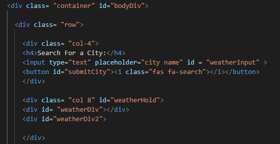
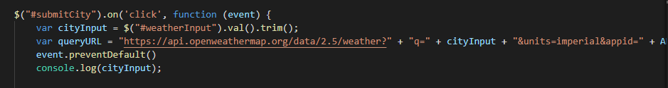
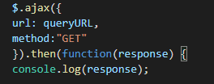

# CityWeatherApp

I used the "weatherdDiv1" and "weatherDiv2" divs to hold the content that is retreived from the API.

This queries the API and creates an event that occurs when the user presses the submit button.

This ajax creates a promise and logs it 

These are the variables that are used to grab responses from the API to give the user the information they require.

